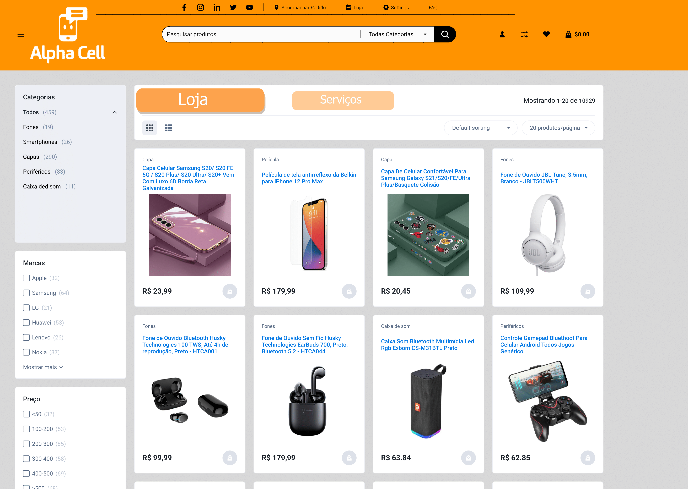
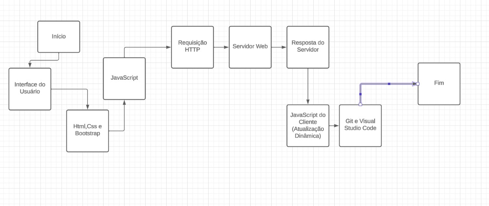

# Informações do Projeto
`TÍTULO DO PROJETO`  

Alpha Cell

`Curso` 

Sistemas de Informação

## Participantes

>
> Os membros do grupo são: 
> - Leonardo Martins Antunes Lopes
> - Caio Henrique Queiroz do Santos
> - Gabriel Eduardo Ramos Vignoli
> - Cleber Gomes Junior
> - Eric Carvalho Pedro
> - Thales Henrique Santos Vasconcelos de Andrade

# Estrutura do Documento

- [Informações do Projeto](#informações-do-projeto)
  - [Participantes](#participantes)
- [Estrutura do Documento](#estrutura-do-documento)
- [Introdução](#introdução)
  - [Problema](#problema)
  - [Objetivos](#objetivos)
  - [Justificativa](#justificativa)
  - [Público-Alvo](#público-alvo)
- [Especificações do Projeto](#especificações-do-projeto)
  - [Personas e Mapas de Empatia](#personas-e-mapas-de-empatia)
  - [Histórias de Usuários](#histórias-de-usuários)
  - [Requisitos](#requisitos)
    - [Requisitos Funcionais](#requisitos-funcionais)
    - [Requisitos não Funcionais](#requisitos-não-funcionais)
  - [Restrições](#restrições)
- [Projeto de Interface](#projeto-de-interface)
  - [User Flow](#user-flow)
  - [Wireframes](#wireframes)
- [Metodologia](#metodologia)
  - [Divisão de Papéis](#divisão-de-papéis)
  - [Ferramentas](#ferramentas)
  - [Controle de Versão](#controle-de-versão)
- [**############## SPRINT 1 ACABA AQUI #############**](#-sprint-1-acaba-aqui-)
- [Projeto da Solução](#projeto-da-solução)
  - [Tecnologias Utilizadas](#tecnologias-utilizadas)
  - [Arquitetura da solução](#arquitetura-da-solução)
- [Avaliação da Aplicação](#avaliação-da-aplicação)
  - [Plano de Testes](#plano-de-testes)
  - [Ferramentas de Testes (Opcional)](#ferramentas-de-testes-opcional)
  - [Registros de Testes](#registros-de-testes)
- [Referências](#referências)

# Introdução
Alpha Cell Assistência técnica                                          
Endereço: Rua Rio de janeiro 437 centro Betim MG                      
Whatsapp: (31) 998477520                                              
Instagram: [@alphacellbetim](https://www.instagram.com/alphacellbetim/)

## Problema

A Alpha Cell, como uma loja de celulares que opera no mundo físico, enfrenta diversos desafios e inconveniências. Entre os problemas que a Alpha Cell enfrenta estão:

- A inacessibilidade para muitos clientes em potencial devido à distância geográfica em relação à loja física. Isso limita o alcance da loja e impede que clientes em áreas distantes tenham fácil acesso aos serviços e produtos oferecidos.
- Dificuldades na organização do agendamento de clientes, juntamente com a falta de uma lista de prioridades. Isso pode resultar em atrasos no atendimento e na dificuldade de gerenciar o fluxo de clientes de maneira eficiente, levando a experiências insatisfatórias.
- A necessidade de deslocamento por parte do cliente até a loja para receber atendimento imediato. Isso não apenas inconveniencia os clientes, mas também os obriga a gastar tempo e recursos adicionais para receber assistência presencial que frequentemente poderia ser solucionado ou antecipado online.                 

## Objetivos

A criação de uma interface web para a Alpha Cell, a loja de conserto de celulares, tem como objetivo possibilitar aos clientes a compra de Periféricos e componentes online, oferecendo também a funcionalidade de cadastro para que eles possam se comunicar com os vendedores e técnicos, acumulando pontos em suas compras. Além disso, essa plataforma permitirá o monitoramento do inventário e a criação de uma lista de agendamento para os clientes.

## Justificativa

A criação de um site para uma loja de conserto de celulares é essencial como parte de uma estratégia para ampliar o alcance, aprimorar a experiência do cliente, impulsionar a eficiência operacional e atender às
demandas do mercado atual. Alguns dos motivos-chave para a criação de um site incluem:

- Aumento da Visibilidade Online: Ter um site permite que a loja de conserto de celulares seja encontrada facilmente pelos clientes que procuram serviços de reparo na internet. Isso amplia a visibilidade da empresa e a torna acessível a um público mais amplo, incluindo aqueles que podem não estar cientes da loja fisicamente.
- Facilidade de Informação: O site serve como uma plataforma centralizada para fornecer informações detalhadas sobre os serviços oferecidos, horários de funcionamento, localização da loja física e métodos de contato. Os clientes podem acessar essas informações a qualquer momento, facilitando o planejamento de suas visitas.
- Acesso a Clientes Potenciais: Um site permite que a loja alcance clientes que estão procurando serviços de conserto de celulares online. Isso é especialmente valioso para pessoas que preferem pesquisar e comparar opções antes de tomar uma decisão.
- Agendamento Online: A implementação de um sistema de agendamento online facilita a vida dos clientes, permitindo que eles marquem horários para o reparo de seus dispositivos diretamente pelo site. Isso economiza tempo tanto para os clientes quanto para a equipe da loja, melhorando a eficiência geral.
- Acompanhamento de Pedidos: Os clientes podem usar o site para acompanhar o status de seus pedidos ou reparos em andamento. Isso proporciona transparência e tranquilidade aos clientes, pois eles podem verificar o progresso a qualquer momento.

## Público-Alvo

Temos como publico alvo todo tipo de pessoa que precisa consertar smartphones ou adquirir acessórios e periféricos para seu aparelho, com foco em pessoas que trabalham utilizando o celular, pois com a implementação da interface será possível criar uma forma de agendamento prioritário para casos que precisem urgência. 
 
# Especificações do Projeto

O projeto Alpha Cell tem como objetivo criar um site intuitivo e funcional para oferecer informações sobre serviços de reparo de celulares. Nosso público-alvo são os clientes em busca de serviços de reparo de celulares e informações sobre a loja. Para alcançar esse objetivo, utilizaremos as seguintes técnicas e ferramentas:
Ferramentas utilizadas:
> Wireframing: Faremos uso de ferramentas como Photoshop e Figma para criar wireframes detalhados das páginas.
> Mapa de Empatia e Personas para exemplificar possíveis clientes.                                           
> Design Responsivo: Vamos adotar frameworks como Bootstrap para garantir um design responsivo e consistente.

O projeto Alpha Cell tem como objetivo fornecer uma interface web eficaz e informativa para atender tanto aos clientes em busca de serviços de reparo de celulares quanto aos interessados em acessórios para dispositivos móveis. As técnicas e ferramentas mencionadas serão empregadas para garantir que o site atenda às expectativas dos usuários e aos objetivos da loja.

## Personas e Mapas de Empatia

 

 
 
 
 
 

 

 

 

 
 
 

   

## Histórias de Usuários

Com base na análise das personas forma identificadas as seguintes histórias de usuários:

|EU COMO... `PERSONA`| QUERO/PRECISO ... `FUNCIONALIDADE` |PARA ... `MOTIVO/VALOR`                 |
|--------------------|------------------------------------|----------------------------------------|
|Administrador       | Cadastrar e Gerenciar os Produtos  | Gerenciar Estoque                      |
|Administrador       | Gerenciar os Pedidos               | Organizar os pedidos e suas prioridades|
|Usuário do sistema  | Visualizar os Produtos             | Comprar e comprarar preços             |
|Usuário do sistema  | Visualizar os Serviços             | Acompanhar status do serviço           |
|Usuário do sistema  | Adicionar produtos ao carrinho     | Realizar várias compras simultaneamente|
|Usuário do sistema  | Criar e acessar minha conta        | Acessar o sistema                      |
|Usuário do sistema  | Solicitar serviços                 | Fazer orçamento de manutenção          |
|Usuário do sistema  | Utiliza o navegador pelo celular   | Acessar  o sistema pelo celular        |

## Requisitos

As tabelas que se seguem apresentam os requisitos funcionais e não funcionais que detalham o escopo do projeto.

### Requisitos Funcionais

|ID    | Descrição do Requisito  | Prioridade |
|------|-----------------------------------------|----|
|RF-001| Permitir que o administrador cadastre e altere produtos      | ALTA | 
|RF-002| Permitir o usuário visualizar status do serviço              | MÉDIA |
|RF-003| Permitir a visualização dos produtos pelo usuário            | ALTA | 
|RF-004| Organizar pedidos e permitir alterar o status e prioridade   | MÉDIA |
|RF-005| Permitir que o usuário Visualizar serviços                   | ALTA | 
|RF-006| Disponibilizar orçamento de serviço pelo sistema             | MÉDIA |

### Requisitos não Funcionais

|ID     | Descrição do Requisito  |Prioridade |
|-------|-------------------------|----|
|RNF-001| O sistema deve ser responsivo para rodar em um dispositivos móvel | MÉDIA | 
|RNF-002| O programa deve ser capaz de se integrar com sistemas de pagamento online. |  ALTA |
|RNF-003| O Sistema deve garantir a segurança dos dados do usuário |  ALTA |

## Restrições

O projeto está restrito pelos itens apresentados na tabela a seguir.

|ID| Restrição                                             |
|--|-------------------------------------------------------|
|01| O projeto deverá ser entregue até o final do semestre |
|02| Não pode ser desenvolvido um módulo de backend        |

# Projeto de Interface

A partir das informações apresentadas nas Histórias de Usuário e Requisitos Funcionais, desenvolveremos interfaces que permitam ao administrador gerenciar produtos e pedidos, enquanto os usuários poderão visualizar produtos, serviços, realizar compras e solicitar orçamentos de serviços de reparo de celulares. As interfaces também serão responsivas para garantir a acessibilidade em dispositivos móveis, atendendo ao Requisito Não Funcional RNF-001.

Além disso, considerando o Requisito Não Funcional RNF-002, a solução será projetada de forma a integrar-se com sistemas de pagamento online para facilitar as transações de compras.

As interfaces serão desenvolvidas com foco na usabilidade, com layouts intuitivos e elementos de design que reflitam a identidade da marca Alpha Cell. Isso incluirá uma paleta de cores referente à marca já existente. A seguir, apresentaremos as principais interfaces da solução.

## User Flow

O fluxograama abaixo representa o fluxo do usuário no site.
O diagrama a esquerda indica ações que podem ser realizadas tanto pelo cliente quanto pelo administrador, enquanto o diagrama à direita mostra ações a serem realizadas apenas pelo administrador

## Wireframes

A imagem a seguir representa o wireframe da página inicial da loja. 
> 

# Metodologia

 - Para atender à demanda de desenvolver múltiplas páginas web para o nosso projeto, tivemos uma conversa em equipe e decidimos que cada membro seria responsável por criar uma página. Essa abordagem não apenas poupou tempo, mas também permitiu a criação simultânea de todas as páginas. Além disso, estabelecemos reuniões semanais, geralmente às segundas-feiras, para debater ideias e manter o site atualizado. Esses encontros foram cruciais para o nosso progresso e colaboração constante.

## Divisão de Papéis

 - Todos os membros do grupo assumiram papéis idênticos no projeto. Cada um foi encarregado da criação do código e outras tarefas ao longo de todo o desenvolvimento. Essa distribuição equitativa de responsabilidades garantiu uma colaboração integral e uma contribuição uniforme de cada membro para o sucesso do projeto. A única divisão realizada foi a de decidir quem iria fazer qual página. Segue abaixo a divisão:
 

## Ferramentas

| Ambiente  | Plataforma              |Link de Acesso |
|-----------|-------------------------|---------------|
|Processo de Design Thinking  | Sites de lojas | https://www.mercadolivre.com.br // https://www.kabum.com.br | 
|Repositório de código | GitHub | https://github.com/ICEI-PUC-Minas-PBE-SI/pbe-si-ads-2023-2-tiaw-t1-grupo-loja-de-celulares | 
|Hospedagem do site | GitHub Pages | https://github.com/ICEI-PUC-Minas-PBE-SI/pbe-si-ads-2023-2-tiaw-t1-grupo-loja-de-celulares.git | 
|Protótipo Interativo | Figma | https://www.figma.com/file/yeQokxPzF8uvAhALXrbLuj/Untitled?type=design&node-id=1-16&mode=design | 

 - Nosso processo de design thinking se inspirou nos sites já consolidados no mercado. Absorvemos o melhor dessas referências para formular a identidade do nosso projeto. Exploramos os elementos de sucesso dessas plataformas, adaptando-os da nossa maneira para moldar um site cativante aos visitantes da nossa loja online.
 - Optamos pelo GitHub como o repositório para nosso código devido à sua incrível integração com o Vs Code. Essa sinergia permite editar o programa diretamente no Vs Code e, em seguida, compartilhá-lo no GitHub, permitindo que todos no grupo visualizem as modificações feitas. Essa conexão perfeita entre as plataformas facilitou nossa colaboração e trouxe uma dinâmica incrível ao nosso trabalho em equipe.
 - Optamos por hospedar nosso site utilizando o GitHub, aproveitando a plataforma GitHub Pages para acompanhar de perto o desenvolvimento do nosso projeto na prática. Essa escolha não apenas ofereceu a hospedagem necessária, mas também nos permitiu visualizar em tempo real o progresso e a evolução do nosso site de forma prática e acessível a todos os envolvidos.
 - O Figma foi nossa escolha principal para a criação do protótipo interativo, principalmente por conta dos seus recursos integrados. Essa plataforma não apenas nos permitiu desenvolver as interfaces necessárias, mas também se destacou na facilitação da colaboração flexível em todo o projeto. Sua versatilidade e ferramentas intuitivas tornaram o processo de design mais eficiente, possibilitando uma criação interativa que agregou dinamismo e precisão à nossa equipe.
> Liste as ferramentas empregadas no desenvolvimento do
> projeto, justificando a escolha delas, sempre que possível.
> 
> As ferramentas empregadas no projeto são:
> 
> - Editor de código.
> - Ferramentas de comunicação
> - Ferramentas de diagramação
> - Plataforma de hospedagem
> 
> O editor de código foi escolhido porque ele possui uma integração com o
> sistema de versão. As ferramentas de comunicação utilizadas possuem
> integração semelhante e por isso foram selecionadas. Por fim, para criar
> diagramas utilizamos essa ferramenta por melhor captar as
> necessidades da nossa solução.

## Controle de Versão

......  COLOQUE AQUI O SEU TEXTO ......

> Discuta como a configuração do projeto foi feita na ferramenta de
> versionamento escolhida. Exponha como a gerência de tags, merges,
> commits e branchs é realizada. Discuta como a gerência de issues foi
> realizada.
> A ferramenta de controle de versão adotada no projeto foi o
> [Git](https://git-scm.com/), sendo que o [Github](https://github.com)
> foi utilizado para hospedagem do repositório `upstream`.
> 
> O projeto segue a seguinte convenção para o nome de branchs:
> 
> - `master`: versão estável já testada do software
> - `unstable`: versão já testada do software, porém instável
> - `testing`: versão em testes do software
> - `dev`: versão de desenvolvimento do software
> 
> Quanto à gerência de issues, o projeto adota a seguinte convenção para
> etiquetas:
> 
> - `bugfix`: uma funcionalidade encontra-se com problemas
> - `enhancement`: uma funcionalidade precisa ser melhorada
> - `feature`: uma nova funcionalidade precisa ser introduzida
>
> **Links Úteis**:
> - [Tutorial GitHub](https://guides.github.com/activities/hello-world/)
> - [Git e Github](https://www.youtube.com/playlist?list=PLHz_AreHm4dm7ZULPAmadvNhH6vk9oNZA)
> - [5 Git Workflows & Branching Strategy to deliver better code](https://zepel.io/blog/5-git-workflows-to-improve-development/)
>
> **Exemplo - GitHub Feature Branch Workflow**:
>
> 

# **############## SPRINT 1 ACABA AQUI #############**

# Projeto da Solução

......  COLOQUE AQUI O SEU TEXTO ......

## Tecnologias Utilizadas

Durante o desenvolvimento do projeto, utilizamos uma combinação de tecnologias essenciais para criar uma aplicação web moderna e eficiente. As linguagens de programação principais incluíram HTML, CSS e JavaScript, formando a base sólida da estrutura, estilo e interatividade da aplicação.
Para garantir um design responsivo e a implementação de componentes pré-construídos de maneira eficiente, empregamos o framework Bootstrap. Essa ferramenta proporcionou uma integração suave e contribuiu significativamente para a estética profissional da interface do usuário.
A escolha da IDE foi orientada pela familiaridade com a aplicação, uma vez que o Visual Studio Code é amplamente utilizado no ensino na Faculdade PUC Minas. Essa ferramenta, além de ser robusta e altamente configurável, oferece suporte a diversas linguagens de programação. A eficiência e a facilidade de uso proporcionadas por essa IDE foram cruciais para o desenvolvimento produtivo do projeto.
No que diz respeito ao controle de versão, adotamos o Git como sistema de gerenciamento, permitindo rastrear e documentar todas as alterações realizadas no código. Isso não apenas facilitou a colaboração com outros desenvolvedores, mas também proporcionou uma segurança adicional ao projeto.
Essa combinação de tecnologias, aliada ao ambiente de desenvolvimento proporcionado pelo Visual Studio Code e à gestão eficiente de versões com o Git, resultou em um projeto coeso, visualmente atraente e funcional. A sinergia entre essas ferramentas desempenhou um papel crucial na criação bem-sucedida da aplicação, proporcionando uma experiência de desenvolvimento eficaz e satisfatória.

A seguir, apresentaremos uma figura que esquematiza a relação entre as tecnologias utilizadas e a interação dos usuários com o site. Essa representação visual ajudará a compreender de maneira mais clara como cada componente contribui para a experiência dos usuários, desde a interação inicial até a resposta do sistema. 

será apresentada uma figura que detalha as diferenças entre o wireframe original e o produto final. Essa representação visual oferecerá uma visão comparativa das transformações ocorridas durante o desenvolvimento, destacando como o conceito inicial evoluiu para o resultado final. A figura permitirá uma análise visual das mudanças de layout, design e elementos interativos, proporcionando uma compreensão mais aprofundada do processo de desenvolvimento e refinamento que ocorreu desde a concepção até a implementação do produto final.

Ao observar a figura que compara o wireframe original com o produto final, é possível notar algumas mudanças significativas nas dimensões e no design geral. O produto final apresenta ajustes que contribuem para uma experiência mais aprimorada, oferecendo uma estética mais moderna e atrativa.

As mudanças de dimensões destacam-se como um elemento-chave, evidenciando a otimização do layout para melhor se adequar às necessidades do usuário. Além disso, a introdução de cores vibrantes no produto final adiciona um dinamismo visual, criando uma atmosfera mais cativante e envolvente para os usuários.

O design mais moderno é perceptível em cada detalhe, desde a disposição dos elementos até a escolha de fontes e ícones. Essa abordagem contemporânea não apenas aprimora a estética, mas também contribui para uma experiência de usuário mais intuitiva e alinhada com as tendências atuais de design.

Em resumo, a comparação revela um processo de evolução que visa proporcionar não apenas funcionalidade, mas também uma estética visualmente agradável e atualizada. Essas mudanças refletem um compromisso com a excelência no design, visando atender e superar as expectativas dos usuários finais.

## Arquitetura da solução

O diagrama proposto ilustra a arquitetura e o fluxo de interação em um projeto web, desde a entrada do usuário na interface até a resposta do sistema. As principais tecnologias, como HTML, CSS, Bootstrap e JavaScript, são representadas na camada do cliente, enquanto o servidor web, back-end e banco de dados são destacados na camada do servidor. A comunicação entre cliente e servidor é representada por requisições HTTP, e o controle de versão é gerenciado pelo Git. O Visual Studio Code é utilizado como a IDE principal. As mudanças dimensionais e as cores vibrantes no produto final são observáveis, refletindo um design mais moderno e uma experiência visualmente atrativa para os usuários.

# Avaliação da Aplicação

Teste de Carregamento da Página:

Cenário: Verificar se a página inicial carrega corretamente.
Passos:
Acesse a URL da aplicação.
Observe se todos os elementos da página são carregados corretamente.
Resultado Esperado: Todos os elementos da página são exibidos sem erros.
Teste de Responsividade:

Cenário: Garantir que a aplicação seja responsiva em diferentes dispositivos.
Passos:
Acesse a aplicação em um dispositivo móvel.
Redimensione a janela do navegador para simular diferentes tamanhos de tela.
Resultado Esperado: A aplicação se ajusta adequadamente em diferentes dispositivos e tamanhos de tela.
Teste de Formulário - Envio com Sucesso:

Cenário: Verificar se o formulário de contato pode ser preenchido e enviado corretamente.
Passos:
Preencha todos os campos obrigatórios do formulário.
Clique no botão de envio.
Resultado Esperado: O formulário é enviado sem erros e o usuário recebe uma confirmação de sucesso.
Teste de Formulário - Validação de Campos Obrigatórios:

Cenário: Testar a validação dos campos obrigatórios do formulário.
Passos:
Tente enviar o formulário sem preencher todos os campos obrigatórios.
Resultado Esperado: O sistema impede o envio do formulário e exibe mensagens de erro para os campos obrigatórios não preenchidos.
Teste de Funcionalidade JavaScript - Interação Dinâmica:

Cenário: Verificar se as funcionalidades interativas implementadas em JavaScript estão funcionando corretamente.
Passos:
Interaja com elementos interativos, como botões ou sliders.
Observe se as alterações são refletidas dinamicamente na página.
Resultado Esperado: As interações do usuário são respondidas corretamente pela aplicação.
Teste de Segurança - Injeção de Scripts:

Cenário: Testar a segurança contra injeção de scripts.
Passos:
Tente inserir scripts maliciosos em campos de entrada.
Resultado Esperado: O sistema valida e filtra corretamente entradas de dados para evitar injeção de scripts.
Teste de Navegação - Links e Botões:

Cenário: Verificar se todos os links e botões da aplicação direcionam para as páginas corretas.
Passos:
Clique em todos os links e botões presentes na aplicação.
Resultado Esperado: Todos os redirecionamentos são feitos corretamente.
Teste de Desempenho - Carregamento Rápido:

Cenário: Avaliar o desempenho da aplicação em termos de velocidade de carregamento.
Passos:
Use ferramentas de desenvolvedor para analisar o tempo de carregamento da página.
Resultado Esperado: A aplicação carrega rapidamente, dentro de um tempo aceitável.

## Plano de Testes

Objetivo do Teste:
Avaliar a funcionalidade, usabilidade e desempenho da aplicação web para garantir uma experiência de usuário positiva.

Cenários de Testes Selecionados:

Funcionalidades Avaliadas: Carregamento correto da página inicial.
Grupo de Usuários: Todos os usuários.
Ferramentas Utilizadas: Navegadores padrão (Chrome, Firefox, Safari, Edge).
Teste de Responsividade:

Funcionalidades Avaliadas: Adaptabilidade em diferentes dispositivos.
Grupo de Usuários: Usuários que acessam a aplicação por meio de dispositivos móveis.
Ferramentas Utilizadas: Dispositivos móveis reais e emuladores, ferramentas de inspeção de navegador.
Teste de Formulário - Envio com Sucesso:

Funcionalidades Avaliadas: Funcionalidade do formulário de contato.
Grupo de Usuários: Usuários que utilizam o formulário de contato.
Ferramentas Utilizadas: Ferramentas de automação de teste (por exemplo, Selenium), validação manual.
Teste de Funcionalidade JavaScript - Interação Dinâmica:

Funcionalidades Avaliadas: Verificar se as funcionalidades interativas implementadas em JavaScript estão funcionando corretamente.
Grupo de Usuários: Todos os usuários.
Ferramentas Utilizadas: Ferramentas de automação de teste (por exemplo, Selenium), validação manual.

Procedimentos de Teste:

Abriremos a aplicação em diferentes navegadores.
Observará o tempo de carregamento da página inicial.
Verificará se todos os elementos são exibidos corretamente.
Teste de Responsividade:

Acessaremos a aplicação em dispositivos móveis reais e emuladores.
Redimensionará a janela do navegador para simular diferentes tamanhos de tela.
Confirmará se a aplicação se ajusta adequadamente.

Teste de Formulário - Envio com Sucesso:

Preencheremos todos os campos obrigatórios do formulário.
Clicará no botão de envio.
Confirmará se o usuário recebe uma confirmação de sucesso e se os dados são registrados corretamente.

Teste de Funcionalidade JavaScript - Interação Dinâmica:

Interagiremos com elementos interativos, como botões ou sliders.
Observará se as alterações são refletidas dinamicamente na página.
Confirmará se as interações do usuário são respondidas corretamente pela aplicação.
Critérios de Aceitação:
Os testes serão considerados bem-sucedidos se todas as funcionalidades avaliadas passarem nos cenários de teste sem erros críticos. Quaisquer problemas identificados serão documentados e priorizados para correção.

Responsável pelos Testes:
Gabriel Ramos será responsável pela execução dos testes, incluindo testes manuais.

Agenda de Testes:
Os testes serão conduzidos ao longo de uma semana, com cada cenário sendo avaliado em dias específicos. Uma vez concluídos, os resultados serão analisados, e os relatórios de testes serão compartilhados com a equipe de desenvolvimento para implementação de correções, se necessário.

## Ferramentas de Testes (Opcional)

......  COLOQUE AQUI O SEU TEXTO ......

> Comente sobre as ferramentas de testes utilizadas.
> 
> **Links Úteis**:
> - [Ferramentas de Test para Java Script](https://geekflare.com/javascript-unit-testing/)
> - [UX Tools](https://uxdesign.cc/ux-user-research-and-user-testing-tools-2d339d379dc7)

## Registros de Testes

Data do Teste:14/12/2023 

Responsável pelos Testes: Gabriel Ramos

1. Teste de Carregamento da Página
Objetivo: Avaliar o carregamento correto da página inicial.

Passos do Teste:

Abrir a aplicação no navegador Chrome.
Observar o tempo de carregamento da página.
Verificar se todos os elementos são exibidos corretamente.
Resultado:

 Sucesso: A página carregou dentro do tempo esperado e todos os elementos estão visíveis.
 
2. Teste de Responsividade
Objetivo: Verificar a adaptabilidade em diferentes dispositivos.

Passos do Teste:

Acessar a aplicação em um dispositivo móvel real.
Redimensionar a janela do navegador para simular diferentes tamanhos de tela.
Confirmar se a aplicação se ajusta adequadamente.
Resultado:

 Sucesso: A aplicação é responsiva em dispositivos móveis e se adapta a diferentes tamanhos de tela.
 
3. Teste de Formulário - Envio com Sucesso
Objetivo: Verificar a funcionalidade do formulário de contato.

Passos do Teste:

Preencher todos os campos obrigatórios do formulário.
Clicar no botão de envio.
Confirmar se o usuário recebe uma confirmação de sucesso e se os dados são registrados corretamente.
Resultado:

 Sucesso: O formulário é enviado corretamente, e o usuário recebe uma confirmação.

 No entanto, vale enfatizar que o login e senha cadastrados só valem como login no momento em que o cadastro é feito, caso o usuário deslogue da conta, vá para a página inicial e tente logar novamente, as informações de login não terão mais validade.

4. Teste de Funcionalidade JavaScript - Interação Dinâmica
Objetivo: Verificar se as funcionalidades interativas implementadas em JavaScript estão funcionando corretamente.

Passos do Teste:

Interagir com elementos interativos, como botões ou sliders.
Observar se as alterações são refletidas dinamicamente na página.
Confirmar se as interações do usuário são respondidas corretamente pela aplicação.
Resultado:

 Sucesso: As funcionalidades interativas estão operando corretamente.

Conclusão:
Os testes foram concluídos. Os resultados foram registrados e serão compartilhados com a equipe de desenvolvimento para correção de quaisquer problemas identificados.

# Referências

1.https://www.mercadolivre.com.br
2.https://www.kabum.com.br
3.https://www.pichau.com.br

