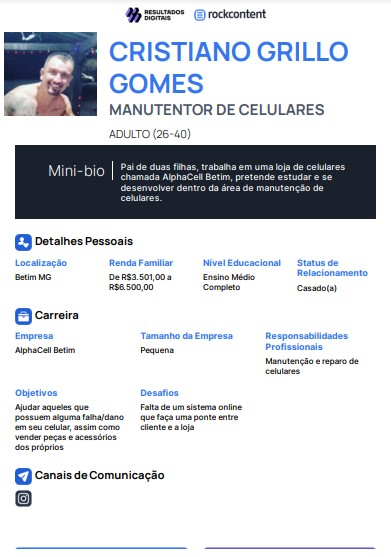
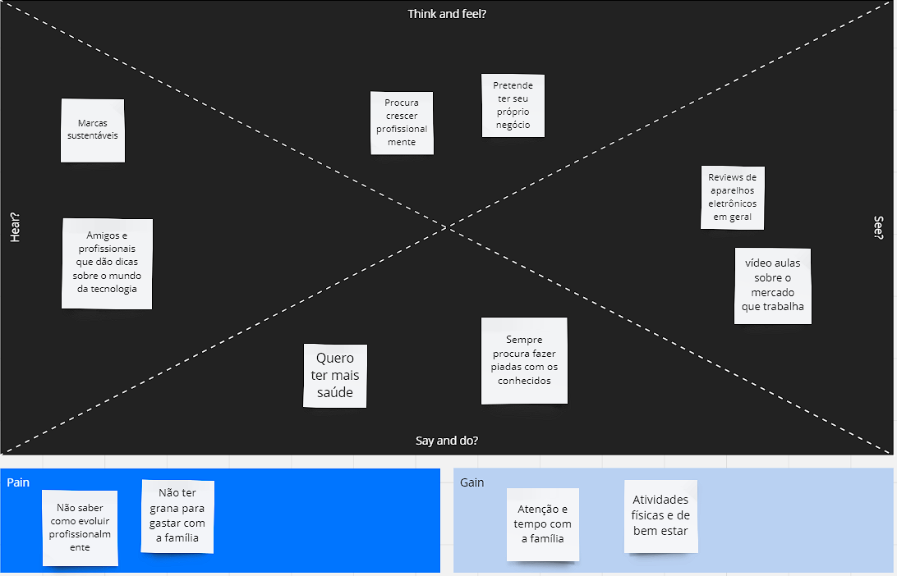
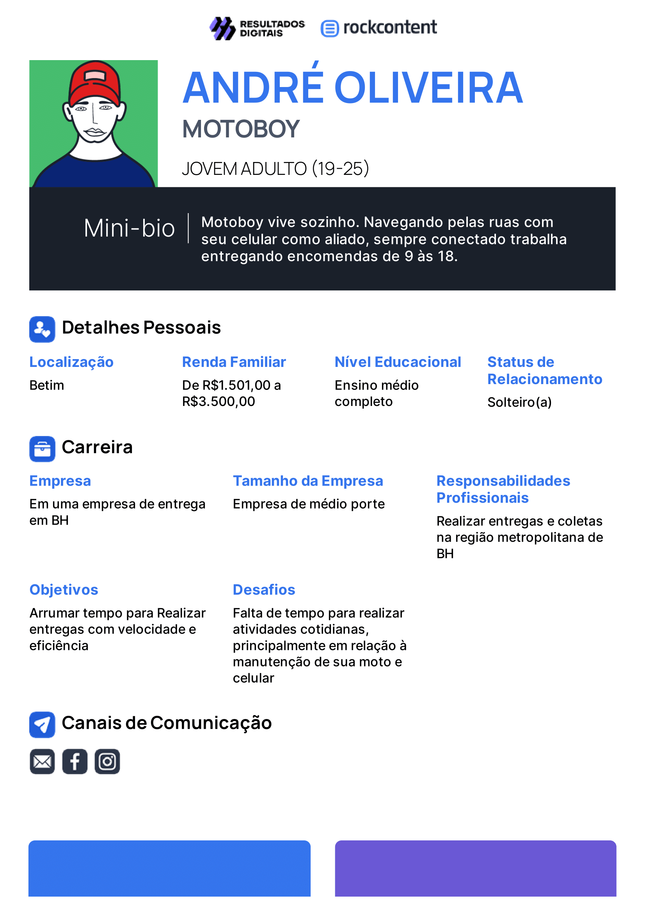
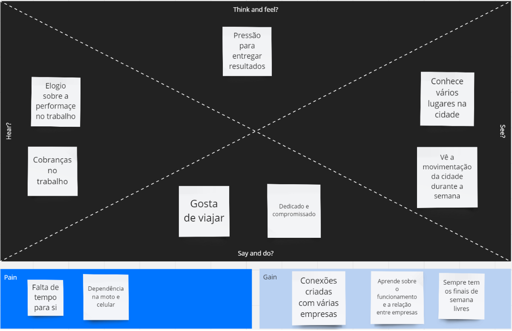
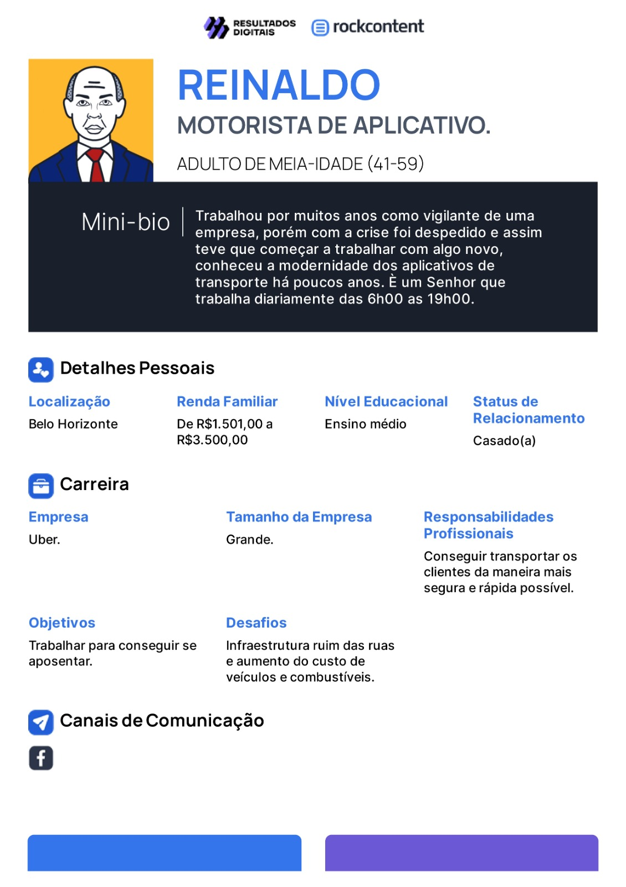
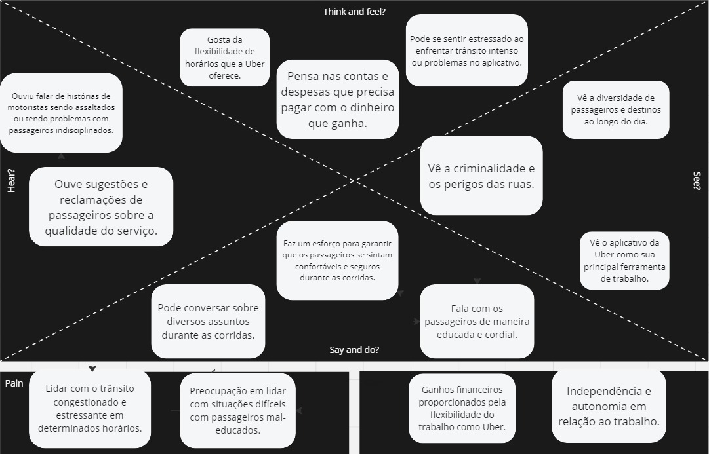
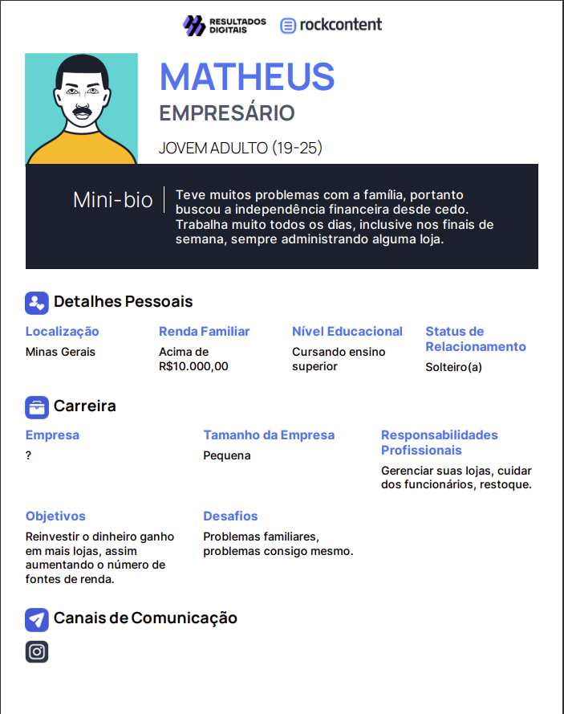
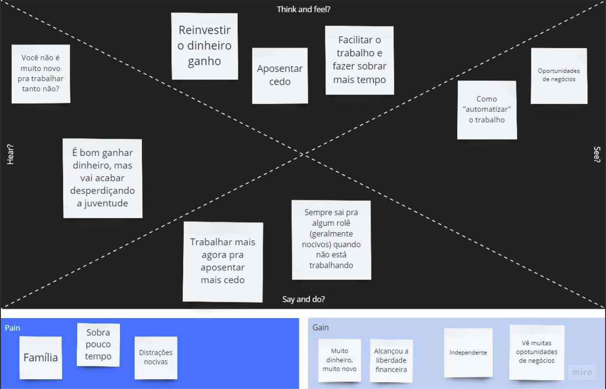
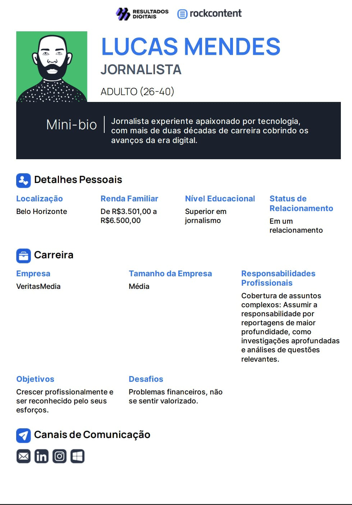
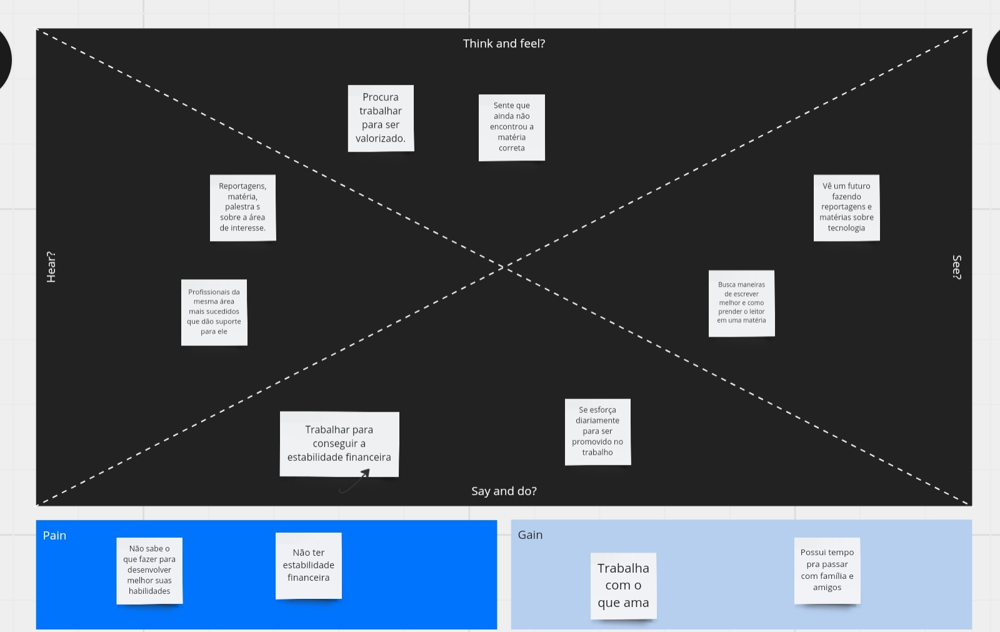

# Informações do Projeto
`TÍTULO DO PROJETO`  

Alpha Cell

`Curso` 

Sistemas de Informação

## Participantes

>
> Os membros do grupo são: 
> - Leonardo Martins Antunes Lopes
> - Caio Henrique Queiroz do Santos
> - Gabriel Eduardo Ramos Vignoli
> - Cleber Gomes Junior
> - Eric Carvalho Pedro
> - Thales Henrique Santos Vasconcelos de Andrade

# Estrutura do Documento

- [Informações do Projeto](#informações-do-projeto)
  - [Participantes](#participantes)
- [Estrutura do Documento](#estrutura-do-documento)
- [Introdução](#introdução)
  - [Problema](#problema)
  - [Objetivos](#objetivos)
  - [Justificativa](#justificativa)
  - [Público-Alvo](#público-alvo)
- [Especificações do Projeto](#especificações-do-projeto)
  - [Personas e Mapas de Empatia](#personas-e-mapas-de-empatia)
  - [Histórias de Usuários](#histórias-de-usuários)
  - [Requisitos](#requisitos)
    - [Requisitos Funcionais](#requisitos-funcionais)
    - [Requisitos não Funcionais](#requisitos-não-funcionais)
  - [Restrições](#restrições)
- [Projeto de Interface](#projeto-de-interface)
  - [User Flow](#user-flow)
  - [Wireframes](#wireframes)
- [Metodologia](#metodologia)
  - [Divisão de Papéis](#divisão-de-papéis)
  - [Ferramentas](#ferramentas)
  - [Controle de Versão](#controle-de-versão)
- [**############## SPRINT 1 ACABA AQUI #############**](#-sprint-1-acaba-aqui-)
- [Projeto da Solução](#projeto-da-solução)
  - [Tecnologias Utilizadas](#tecnologias-utilizadas)
  - [Arquitetura da solução](#arquitetura-da-solução)
- [Avaliação da Aplicação](#avaliação-da-aplicação)
  - [Plano de Testes](#plano-de-testes)
  - [Ferramentas de Testes (Opcional)](#ferramentas-de-testes-opcional)
  - [Registros de Testes](#registros-de-testes)
- [Referências](#referências)

# Introdução
Alpha Cell Assistência técnica                                          
Endereço: Rua Rio de janeiro 437 centro Betim MG                      
Whatsapp: (31) 998477520                                              
Instagram: [@alphacellbetim](https://www.instagram.com/alphacellbetim/)

## Problema

A Alpha Cell, como uma loja de celulares que opera no mundo físico, enfrenta diversos desafios e inconveniências. Entre os problemas que a Alpha Cell enfrenta estão:

- A inacessibilidade para muitos clientes em potencial devido à distância geográfica em relação à loja física. Isso limita o alcance da loja e impede que clientes em áreas distantes tenham fácil acesso aos serviços e produtos oferecidos.
- Dificuldades na organização do agendamento de clientes, juntamente com a falta de uma lista de prioridades. Isso pode resultar em atrasos no atendimento e na dificuldade de gerenciar o fluxo de clientes de maneira eficiente, levando a experiências insatisfatórias.
- A necessidade de deslocamento por parte do cliente até a loja para receber atendimento imediato. Isso não apenas inconveniencia os clientes, mas também os obriga a gastar tempo e recursos adicionais para receber assistência presencial que frequentemente poderia ser solucionado ou antecipado online.                 

## Objetivos

A criação de uma interface web para a Alpha Cell, a loja de conserto de celulares, tem como objetivo possibilitar aos clientes a compra de Periféricos e componentes online, oferecendo também a funcionalidade de cadastro para que eles possam se comunicar com os vendedores e técnicos, acumulando pontos em suas compras. Além disso, essa plataforma permitirá o monitoramento do inventário e a criação de uma lista de agendamento para os clientes.

## Justificativa

A criação de um site para uma loja de conserto de celulares é essencial como parte de uma estratégia para ampliar o alcance, aprimorar a experiência do cliente, impulsionar a eficiência operacional e atender às
demandas do mercado atual. Alguns dos motivos-chave para a criação de um site incluem:

- Aumento da Visibilidade Online: Ter um site permite que a loja de conserto de celulares seja encontrada facilmente pelos clientes que procuram serviços de reparo na internet. Isso amplia a visibilidade da empresa e a torna acessível a um público mais amplo, incluindo aqueles que podem não estar cientes da loja fisicamente.
- Facilidade de Informação: O site serve como uma plataforma centralizada para fornecer informações detalhadas sobre os serviços oferecidos, horários de funcionamento, localização da loja física e métodos de contato. Os clientes podem acessar essas informações a qualquer momento, facilitando o planejamento de suas visitas.
- Acesso a Clientes Potenciais: Um site permite que a loja alcance clientes que estão procurando serviços de conserto de celulares online. Isso é especialmente valioso para pessoas que preferem pesquisar e comparar opções antes de tomar uma decisão.
- Agendamento Online: A implementação de um sistema de agendamento online facilita a vida dos clientes, permitindo que eles marquem horários para o reparo de seus dispositivos diretamente pelo site. Isso economiza tempo tanto para os clientes quanto para a equipe da loja, melhorando a eficiência geral.
- Acompanhamento de Pedidos: Os clientes podem usar o site para acompanhar o status de seus pedidos ou reparos em andamento. Isso proporciona transparência e tranquilidade aos clientes, pois eles podem verificar o progresso a qualquer momento.

## Público-Alvo

Temos como publico alvo todo tipo de pessoa que precisa consertar smartphones ou adquirir acessórios e periféricos para seu aparelho, com foco em pessoas que trabalham utilizando o celular, pois com a implementação da interface será possível criar uma forma de agendamento prioritário para casos que precisem urgência. 
 
# Especificações do Projeto

O projeto Alpha Cell tem como objetivo criar um site intuitivo e funcional para oferecer informações sobre serviços de reparo de celulares. Nosso público-alvo são os clientes em busca de serviços de reparo de celulares e informações sobre a loja. Para alcançar esse objetivo, utilizaremos as seguintes técnicas e ferramentas:
Ferramentas utilizadas:
> Wireframing: Faremos uso de ferramentas como Photoshop e Figma para criar wireframes detalhados das páginas.
> Mapa de Empatia e Personas para exemplificar possíveis clientes.                                           
> Design Responsivo: Vamos adotar frameworks como Bootstrap para garantir um design responsivo e consistente.

O projeto Alpha Cell tem como objetivo fornecer uma interface web eficaz e informativa para atender tanto aos clientes em busca de serviços de reparo de celulares quanto aos interessados em acessórios para dispositivos móveis. As técnicas e ferramentas mencionadas serão empregadas para garantir que o site atenda às expectativas dos usuários e aos objetivos da loja.

## Personas e Mapas de Empatia

 

 
 
 
 
 

 

 

 

 
 
 

   

## Histórias de Usuários

Com base na análise das personas forma identificadas as seguintes histórias de usuários:

|EU COMO... `PERSONA`| QUERO/PRECISO ... `FUNCIONALIDADE` |PARA ... `MOTIVO/VALOR`                 |
|--------------------|------------------------------------|----------------------------------------|
|Administrador       | Cadastrar e Gerenciar os Produtos  | Gerenciar Estoque                      |
|Administrador       | Gerenciar os Pedidos               | Organizar os pedidos e suas prioridades|
|Usuário do sistema  | Visualizar os Produtos             | Comprar e comprarar preços             |
|Usuário do sistema  | Visualizar os Serviços             | Acompanhar status do serviço           |
|Usuário do sistema  | Adicionar produtos ao carrinho     | Realizar várias compras simultaneamente|
|Usuário do sistema  | Criar e acessar minha conta        | Acessar o sistema                      |
|Usuário do sistema  | Solicitar serviços                 | Fazer orçamento de manutenção          |
|Usuário do sistema  | Utiliza o navegador pelo celular   | Acessar  o sistema pelo celular        |

## Requisitos

As tabelas que se seguem apresentam os requisitos funcionais e não funcionais que detalham o escopo do projeto.

### Requisitos Funcionais

|ID    | Descrição do Requisito  | Prioridade |
|------|-----------------------------------------|----|
|RF-001| Permitir que o administrador cadastre e altere produtos      | ALTA | 
|RF-002| Permitir o usuário visualizar status do serviço              | MÉDIA |
|RF-003| Permitir a visualização dos produtos pelo usuário            | ALTA | 
|RF-004| Organizar pedidos e permitir alterar o status e prioridade   | MÉDIA |
|RF-005| Permitir que o usuário Visualizar serviços                   | ALTA | 
|RF-006| Disponibilizar orçamento de serviço pelo sistema             | MÉDIA |

### Requisitos não Funcionais

|ID     | Descrição do Requisito  |Prioridade |
|-------|-------------------------|----|
|RNF-001| O sistema deve ser responsivo para rodar em um dispositivos móvel | MÉDIA | 
|RNF-002| O programa deve ser capaz de se integrar com sistemas de pagamento online. |  ALTA |
|RNF-003| O Sistema deve garantir a segurança dos dados do usuário |  ALTA |

## Restrições

O projeto está restrito pelos itens apresentados na tabela a seguir.

|ID| Restrição                                             |
|--|-------------------------------------------------------|
|01| O projeto deverá ser entregue até o final do semestre |
|02| Não pode ser desenvolvido um módulo de backend        |

# Projeto de Interface

A partir das informações apresentadas nas Histórias de Usuário e Requisitos Funcionais, desenvolveremos interfaces que permitam ao administrador gerenciar produtos e pedidos, enquanto os usuários poderão visualizar produtos, serviços, realizar compras e solicitar orçamentos de serviços de reparo de celulares. As interfaces também serão responsivas para garantir a acessibilidade em dispositivos móveis, atendendo ao Requisito Não Funcional RNF-001.

Além disso, considerando o Requisito Não Funcional RNF-002, a solução será projetada de forma a integrar-se com sistemas de pagamento online para facilitar as transações de compras.

As interfaces serão desenvolvidas com foco na usabilidade, com layouts intuitivos e elementos de design que reflitam a identidade da marca Alpha Cell. Isso incluirá uma paleta de cores referente à marca já existente. A seguir, apresentaremos as principais interfaces da solução.

## User Flow

O fluxograama abaixo representa o fluxo do usuário no site.
O diagrama a esquerda indica ações que podem ser realizadas tanto pelo cliente quanto pelo administrador, enquanto o diagrama à direita mostra ações a serem realizadas apenas pelo administrador

## Wireframes

A imagem a seguir representa o wireframe da página inicial da loja. 
> 

# Metodologia

 - Para atender à demanda de desenvolver múltiplas páginas web para o nosso projeto, tivemos uma conversa em equipe e decidimos que cada membro seria responsável por criar uma página. Essa abordagem não apenas poupou tempo, mas também permitiu a criação simultânea de todas as páginas. Além disso, estabelecemos reuniões semanais, geralmente às segundas-feiras, para debater ideias e manter o site atualizado. Esses encontros foram cruciais para o nosso progresso e colaboração constante.

> Nesta parte do documento, você deve apresentar a metodologia 
> adotada pelo grupo, descrevendo o processo de trabalho baseado nas metodologias ágeis, 
> a divisão de papéis e tarefas, as ferramentas empregadas e como foi realizada a
> gestão de configuração do projeto via GitHub.
>
> Coloque detalhes sobre o processo de Design Thinking e a implementação do Framework Scrum seguido
> pelo grupo. O grupo poderá fazer uso de ferramentas on-line para acompanhar
> o andamento do projeto, a execução das tarefas e o status de desenvolvimento
> da solução.
> 
> **Links Úteis**:
> - [Tutorial Trello](https://trello.com/b/8AygzjUA/tutorial-trello)
> - [Gestão ágil de projetos com o Trello](https://www.youtube.com/watch?v=1o9BOMAKBRE)
> - [Gerência de projetos - Trello com Scrum](https://www.youtube.com/watch?v=DHLA8X_ujwo)
> - [Tutorial Slack](https://slack.com/intl/en-br/)

## Divisão de Papéis

 - Todos os membros do grupo assumiram papéis idênticos no projeto. Cada um foi encarregado da criação do código e outras tarefas ao longo de todo o desenvolvimento. Essa distribuição equitativa de responsabilidades garantiu uma colaboração integral e uma contribuição uniforme de cada membro para o sucesso do projeto.

> Apresente a divisão de papéis e tarefas entre os membros do grupo.
>
> **Links Úteis**:
> - [11 Passos Essenciais para Implantar Scrum no seu Projeto](https://mindmaster.com.br/scrum-11-passos/)
> - [Scrum em 9 minutos](https://www.youtube.com/watch?v=XfvQWnRgxG0)

## Ferramentas

......  COLOQUE AQUI O SEU TEXTO - SIGA O EXEMPLO DA TABELA ABAIXO  ......

| Ambiente  | Plataforma              |Link de Acesso |
|-----------|-------------------------|---------------|
|Processo de Design Thinking  | Sites de lojas | https://www.mercadolivre.com.br // https://www.kabum.com.br | 
|Repositório de código | GitHub | https://github.com/ICEI-PUC-Minas-PBE-SI/pbe-si-ads-2023-2-tiaw-t1-grupo-loja-de-celulares | 
|Hospedagem do site | GitHub Pages | https://github.com/ICEI-PUC-Minas-PBE-SI/pbe-si-ads-2023-2-tiaw-t1-grupo-loja-de-celulares.git | 
|Protótipo Interativo | Figma | https://www.figma.com/file/yeQokxPzF8uvAhALXrbLuj/Untitled?type=design&node-id=1-16&mode=design | 

 - Nosso processo de design thinking se inspirou nos sites já consolidados no mercado. Absorvemos o melhor dessas referências para formular a identidade do nosso projeto. Exploramos os elementos de sucesso dessas plataformas, adaptando-os da nossa maneira para moldar um site cativante aos visitantes da nossa loja online.
 - Optamos pelo GitHub como o repositório para nosso código devido à sua incrível integração com o Vs Code. Essa sinergia permite editar o programa diretamente no Vs Code e, em seguida, compartilhá-lo no GitHub, permitindo que todos no grupo visualizem as modificações feitas. Essa conexão perfeita entre as plataformas facilitou nossa colaboração e trouxe uma dinâmica incrível ao nosso trabalho em equipe.
 - Optamos por hospedar nosso site utilizando o GitHub, aproveitando a plataforma GitHub Pages para acompanhar de perto o desenvolvimento do nosso projeto na prática. Essa escolha não apenas ofereceu a hospedagem necessária, mas também nos permitiu visualizar em tempo real o progresso e a evolução do nosso site de forma prática e acessível a todos os envolvidos.
 - O Figma foi nossa escolha principal para a criação do protótipo interativo, principalmente por conta dos seus recursos integrados. Essa plataforma não apenas nos permitiu desenvolver as interfaces necessárias, mas também se destacou na facilitação da colaboração flexível em todo o projeto. Sua versatilidade e ferramentas intuitivas tornaram o processo de design mais eficiente, possibilitando uma criação interativa que agregou dinamismo e precisão à nossa equipe.
> Liste as ferramentas empregadas no desenvolvimento do
> projeto, justificando a escolha delas, sempre que possível.
> 
> As ferramentas empregadas no projeto são:
> 
> - Editor de código.
> - Ferramentas de comunicação
> - Ferramentas de diagramação
> - Plataforma de hospedagem
> 
> O editor de código foi escolhido porque ele possui uma integração com o
> sistema de versão. As ferramentas de comunicação utilizadas possuem
> integração semelhante e por isso foram selecionadas. Por fim, para criar
> diagramas utilizamos essa ferramenta por melhor captar as
> necessidades da nossa solução.
> 
> **Links Úteis - Hospedagem**:
> - [Getting Started with Heroku](https://devcenter.heroku.com/start)
> - [Crie seu Site com o HostGator](https://www.hostgator.com.br/como-publicar-seu-site)
> - [GoDady](https://br.godaddy.com/how-to)
> - [GitHub Pages](https://pages.github.com/)

## Controle de Versão

......  COLOQUE AQUI O SEU TEXTO ......

> Discuta como a configuração do projeto foi feita na ferramenta de
> versionamento escolhida. Exponha como a gerência de tags, merges,
> commits e branchs é realizada. Discuta como a gerência de issues foi
> realizada.
> A ferramenta de controle de versão adotada no projeto foi o
> [Git](https://git-scm.com/), sendo que o [Github](https://github.com)
> foi utilizado para hospedagem do repositório `upstream`.
> 
> O projeto segue a seguinte convenção para o nome de branchs:
> 
> - `master`: versão estável já testada do software
> - `unstable`: versão já testada do software, porém instável
> - `testing`: versão em testes do software
> - `dev`: versão de desenvolvimento do software
> 
> Quanto à gerência de issues, o projeto adota a seguinte convenção para
> etiquetas:
> 
> - `bugfix`: uma funcionalidade encontra-se com problemas
> - `enhancement`: uma funcionalidade precisa ser melhorada
> - `feature`: uma nova funcionalidade precisa ser introduzida
>
> **Links Úteis**:
> - [Tutorial GitHub](https://guides.github.com/activities/hello-world/)
> - [Git e Github](https://www.youtube.com/playlist?list=PLHz_AreHm4dm7ZULPAmadvNhH6vk9oNZA)
> - [5 Git Workflows & Branching Strategy to deliver better code](https://zepel.io/blog/5-git-workflows-to-improve-development/)
>
> **Exemplo - GitHub Feature Branch Workflow**:
>
> 

# **############## SPRINT 1 ACABA AQUI #############**

# Projeto da Solução

......  COLOQUE AQUI O SEU TEXTO ......

## Tecnologias Utilizadas

......  COLOQUE AQUI O SEU TEXTO ......

> Descreva aqui qual(is) tecnologias você vai usar para resolver o seu
> problema, ou seja, implementar a sua solução. Liste todas as
> tecnologias envolvidas, linguagens a serem utilizadas, serviços web,
> frameworks, bibliotecas, IDEs de desenvolvimento, e ferramentas.
> Apresente também uma figura explicando como as tecnologias estão
> relacionadas ou como uma interação do usuário com o sistema vai ser
> conduzida, por onde ela passa até retornar uma resposta ao usuário.
> 
> Inclua os diagramas de User Flow, esboços criados pelo grupo
> (stoyboards), além dos protótipos de telas (wireframes). Descreva cada
> item textualmente comentando e complementando o que está apresentado
> nas imagens.

## Arquitetura da solução

......  COLOQUE AQUI O SEU TEXTO E O DIAGRAMA DE ARQUITETURA .......

> Inclua um diagrama da solução e descreva os módulos e as tecnologias
> que fazem parte da solução. Discorra sobre o diagrama.
> 
> **Exemplo do diagrama de Arquitetura**:
> 
> 

# Avaliação da Aplicação

......  COLOQUE AQUI O SEU TEXTO ......

> Apresente os cenários de testes utilizados na realização dos testes da
> sua aplicação. Escolha cenários de testes que demonstrem os requisitos
> sendo satisfeitos.

## Plano de Testes

......  COLOQUE AQUI O SEU TEXTO ......

> Enumere quais cenários de testes foram selecionados para teste. Neste
> tópico o grupo deve detalhar quais funcionalidades avaliadas, o grupo
> de usuários que foi escolhido para participar do teste e as
> ferramentas utilizadas.
> 
> **Links Úteis**:
> - [IBM - Criação e Geração de Planos de Teste](https://www.ibm.com/developerworks/br/local/rational/criacao_geracao_planos_testes_software/index.html)
> - [Práticas e Técnicas de Testes Ágeis](http://assiste.serpro.gov.br/serproagil/Apresenta/slides.pdf)
> -  [Teste de Software: Conceitos e tipos de testes](https://blog.onedaytesting.com.br/teste-de-software/)

## Ferramentas de Testes (Opcional)

......  COLOQUE AQUI O SEU TEXTO ......

> Comente sobre as ferramentas de testes utilizadas.
> 
> **Links Úteis**:
> - [Ferramentas de Test para Java Script](https://geekflare.com/javascript-unit-testing/)
> - [UX Tools](https://uxdesign.cc/ux-user-research-and-user-testing-tools-2d339d379dc7)

## Registros de Testes

......  COLOQUE AQUI O SEU TEXTO ......

> Discorra sobre os resultados do teste. Ressaltando pontos fortes e
> fracos identificados na solução. Comente como o grupo pretende atacar
> esses pontos nas próximas iterações. Apresente as falhas detectadas e
> as melhorias geradas a partir dos resultados obtidos nos testes.

# Referências

......  COLOQUE AQUI O SEU TEXTO ......

> Inclua todas as referências (livros, artigos, sites, etc) utilizados
> no desenvolvimento do trabalho.
> 
> **Links Úteis**:
> - [Formato ABNT](https://www.normastecnicas.com/abnt/trabalhos-academicos/referencias/)
> - [Referências Bibliográficas da ABNT](https://comunidade.rockcontent.com/referencia-bibliografica-abnt/)
